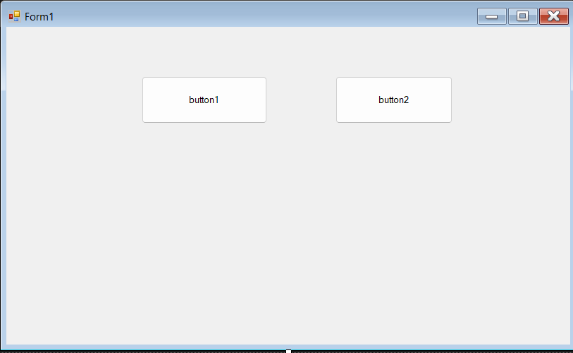
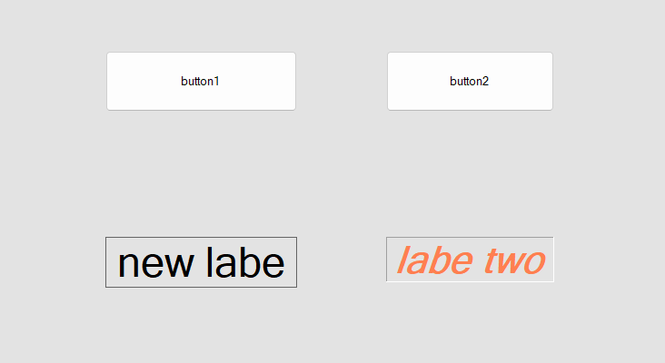

# Week 1 Screenshots

## Screenshot 1: C# Windows Forms GUI

### Explanation

This screenshot shows my C# Windows Forms GUI project.  
I created a simple graphical user interface using Visual Studio.  
The form contains different controls that allow the user to interact with the application.

---

## Screenshot 2: Buttons

### Explanation

This screenshot shows the buttons that I added to my C# Windows Forms application.  
A button allows the user to perform an action when it is clicked.  
I used the buttons as part of the graphical user interface of my application.

---