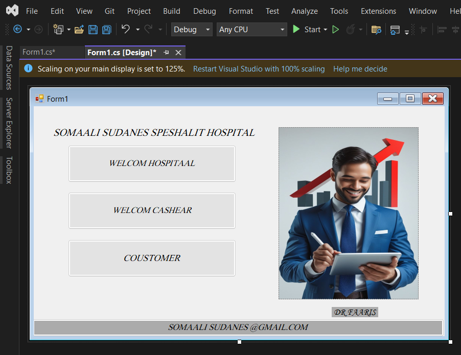

### C# Windows Forms Revision Practice

Form-kan waxaa dare saddex Button oo kala ah:

* WELCOME HOSPITAL
* WELCOME CASHIER
* CUSTOMER

Form-kan waxaa dare PictureBox, kadib geli sawir ku habboon Hospital ama Cashier.

Form-kan waxaa dare Label hoosta sawirka, kuna qore **DR FAHARS**

Qaybta hoose ee Form-ka waxaaku dare Label, kuna qor: **SOMAALI SUDANES @GMAIL.COM**.

Buttons-ka iyo Labels-ka waa u habeeye si ay ugu ekaadaan design-ka sawirka.

waxaa badale Fontiga ka qoraallada si ay ugu ekaadaan kuwa sawirka.

waxaa badale  cabbirka Buttons-ka, PictureBox-ka iyo Form-ka si design-ku u noqdo mid nadiif ah.

waxaa Sameeye practice kale oo isla fikraddan ah, 

qufka batankuurabuu ayuu dooranaya:

* 3 Buttons
* 2 Labels
* 1 PictureBox
* 1 Form

